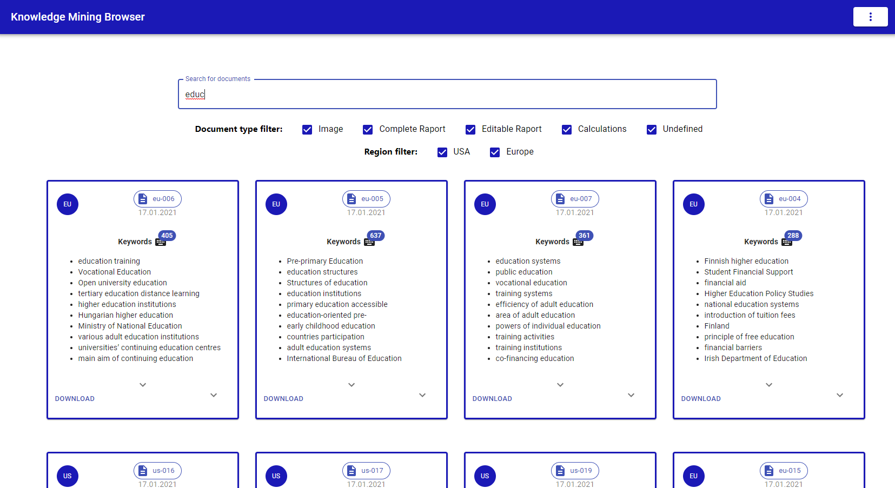
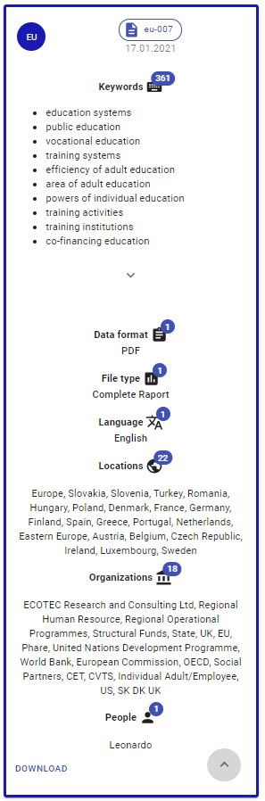

# Knowledge Mining with Cognitive Services

Projekt zewnętrzny dla firmy Semantive realizowany w ramach przedmiotu na PW

## Zespół

* Malwina Kubas
* Michał Bogacz
* Piotr Szubert

## Opis projektu

Wiele organizacji boryka się z problemem zarządzania wiedzą w organizacji. O ile dane dostępne w hurtowniach danych są zrozumiałe dla analityków biznesowych, to dane zamknięte w dokumentach, prezentacjach, obrazach i innych danych unstructured często nie są zarządzane, a wiedza na ich temat jest zamknięta w silosach organizacyjnych. Duża część czasu pracowników jest stracona na manualne, czasochłonne wyszukiwanie właściwego dokumentu. Celem projektu jest zaimplementowanie rozwiązania, które robi ekstrakcję wiedzy z danych Unstructured. Zalecane jest skorzystanie z Cognitive Search Services i przygotowanie Custom Skills, które wyciągają dodatkowe metadane z dokumentów oprócz już dostępnych Skill’i. Rozwiązanie powinno być dostępne jako aplikacja typu Power App, do której można wgrać dowolny dokument i uzyskać metadane. Za konkretny przykład może posłużyć wykrywanie marek (brand) z obrazów lub lokalizowanie (geolocation) dokumentów w oparciu o treści w nich zawarte. Oczekuje się, że studenci przetestują takie rozwiązanie w oparciu o dostępne otwarte danei ustalą konkretny use-case, który wykorzystuje co najmniej 2 Custom Skille. 

## Funkcjonalności aplikacji
* ekstrakcja danych z dokumentów unstructured
* przechowywanie dokumentów i ich metadanych w bazie danych
* wyszukiwarka danych i dokumentów w postaci aplikacji webowej

## Architektura rozwiązania


## Opis działania aplikacji
Pliki dokumentów będą przechowywane w bazie Azure Blob Storage. Z użyciem Function App i Cognitive Services (Text Analytics
oraz Form Recognizer) utworzymy Custom Skille. Wyciągnięte meta-dane będą wyszukiwane poprzez Cognitive Search zintegrowanym 
z API Management. Użytkownik będzie mieć dostęp do dokumentów i ich meta-danych poprzez aplikację webową (Web App), do której
dostęp będzie ograniczony poprzez Active Directory.

Stack: Node, JS, React

Funkcjonalność:
* 2 dopasowane do naszych potrzeb Custom Skille
* wyszukiwanie dokumentów w aplikacji internetowej
* wyświetlanie informacji o znalezionych dokumentach (keywords, language, locations, organizations, people)
* możliwość pobierania dokumentów
* autoryzacja użytkowników

## Dataset

Use Case: przeszukiwanie rządowych dokumentów i raportów statystycznych.

Zbiór dokumentów zawierających raporty Unii Europejskiej i rządu USA: http://www.tamirhassan.com/html/dataset.html

Powyższy zbiór dokumentów został wybrany z uwagi na dużą różnorodność danych oraz formatów przekazywania informacji (opisy słowne, tabelaryczne, numeryczne, grafy oraz przebiegi czasowe). Dzięki takiemu szerokiemu spektrum można przetestować duży zakres różnych typów metadanych używanych w silniku wyszukiwania.

## Custom Skills + Cognitive Search

Custom Skills:

1. name_type i file_type - rozpoznawanie, czy dokument dotyczy Unii Europejskiej, czy USA oraz predykcja typu dokumentu (jeden z: 'Image', 'Classification', 'Complete Raport', 'Undefined', 'Editable Raport', 'Calculations')

2. Poprawa interpretacji państw i ich skrótów - rozwijanie skrótów państw i przypisywanie ich do odpowiedniego pola.

Wykorzystana baza danych: Azure Blob Storage.

Szczegóły dotyczące tworzenia oraz typów użytych Custom Skills, znajdują się w folderze custom_skills.

## Aplikacja webowa + autoryzacja

Link: https://knowledge-mining-browser.azurewebsites.net/

Aplikacja została utworzona w serwisie Web App. Aby nie wystawiać publicznie klucza autoryzującego do Cognitive Search API,
użyty został serwis API Management.

Stack technologiczny to Node.js (v12.18) i React. Pełny kod aplikacji dostępny jest w folderze 'web-app'.

Biblioteki:
* material-ui v4.11.2
* axios v0.21.0
* babel v7.12.10
* react-spinner v4.0.1





Aby opublikować aplikację na Azure, użyliśmy dodatku Azure App Service w VS Code. 

Do utworzenia szkieletu aplikacji wykorzystaliśmy polecenie ```npx create-react-app knowledge-mining```.

Lokalne uruchomienie aplikacji:

```npm install```

```npm start```

Autoryzacja użytkowników: platforma Auth0 zintegrowana z front-endem aplikacji (tutorial: https://auth0.com/blog/complete-guide-to-react-user-authentication/)

## Podział obowiązków

- Michał: utworzenie Custom Skills
- Malwina: UI wyszukiwarki
- Piotr: zapis danych do bazy, pobieranie plików
- Piotr+Michał: Cognitive Search
- Malwina+Piotr: integracja apki z searchem
- Piotr: API Management
- Malwina: autoryzacja użytkowników

## Harmonogram

Pierwszy kamień milowy - 18.01
* pierwsza ekstrakcja danych, 1 Custom Skill - Michał
* działająca baza danych zintegrowana z searchem - Piotr
* proste wyszukiwanie + UI - Malwina

Drugi kamień milowy - 29.01
* drugi Custom Skill - Michał
* autoryzacja użytkowników, dopracowanie UI - Malwina
* pobieranie dokumentów, pełna integracja - Piotr
