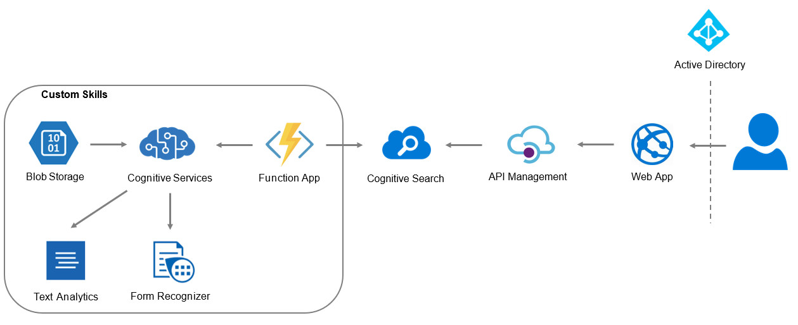

# Knowledge Mining with Cognitive Services

Projekt zewnętrzny dla firmy Semantive realizowany w ramach przedmiotu na PW

## Zespół

* Malwina Kubas
* Michał Bogacz
* Piotr Szubert

Trello: https://trello.com/b/Ta5WQgHy/semantive

## Opis projektu

Wiele organizacji boryka się z problemem zarządzania wiedzą w organizacji. O ile dane dostępne w hurtowniach danych są zrozumiałe dla analityków biznesowych, to dane zamknięte w dokumentach, prezentacjach, obrazach i innych danych unstructured często nie są zarządzane, a wiedza na ich temat jest zamknięta w silosach organizacyjnych. Duża część czasu pracowników jest stracona na manualne, czasochłonne wyszukiwanie właściwego dokumentu. Celem projektu jest zaimplementowanie rozwiązania, które robi ekstrakcję wiedzy z danych Unstructured. Zalecane jest skorzystanie z Cognitive Search Services i przygotowanie Custom Skills, które wyciągają dodatkowe metadane z dokumentów oprócz już dostępnych Skill’i. Rozwiązanie powinno być dostępne jako aplikacja typu Power App, do której można wgrać dowolny dokument i uzyskać metadane. Za konkretny przykład może posłużyć wykrywanie marek (brand) z obrazów lub lokalizowanie (geolocation) dokumentów w oparciu o treści w nich zawarte. Oczekuje się, że studenci przetestują takie rozwiązanie w oparciu o dostępne otwarte danei ustalą konkretny use-case, który wykorzystuje co najmniej 2 Custom Skille. 

## Funkcjonalności aplikacji
* ekstrakcja danych z dokumentów unstructured
* przechowywanie dokumentów i ich metadanych w bazie danych
* wyszukiwarka danych i dokumentów w postaci aplikacji webowej

## Architektura rozwiązania



## Opis działania aplikacji
Pliki dokumentów będą przechowywane w bazie Azure Blob Storage. Z użyciem Function App i Cognitive Services (Text Analytics
oraz Form Recognizer) utworzymy Custom Skille. Wyciągnięte meta-dane będą wyszukiwane poprzez Cognitive Search zintegrowanym 
z API Management. Użytkownik będzie mieć dostęp do dokumentów i ich meta-danych poprzez aplikację webową (Web App), do której
dostęp będzie ograniczony poprzez Active Directory.

Stack: Node, JS, React

## Dataset

Zbiór dokumentów zawierających raporty Unii Europejskiej i rządu USA: http://www.tamirhassan.com/html/dataset.html

Powyższy zbiór dokumentów został wybrany z uwagi na dużą różnorodność danych oraz formatów przekazywania informacji (opisy słowne, tabelaryczne, numeryczne, grafy oraz przebiegi czasowe). Dzięki takiemu szerokiemu spektrum można przetestować duży zakres różnych typów metadanych używanych w silniku wyszukiwania.

Wszystkie pliki dokumentów umieszczone są w formie plików pdf. jest to bardzo wygodne ze względu na dużą dostępność narzędzi pozwalających w łatwy sposób analizować zawartość plików w taki formacie.

Informacje pozyskiwane z dokumentów:

1. Form Recognizer - jedną ze składowych cech charakterystycznych przypisanych do dokumentów będą podstawowe informacje zawarte w dokumencie. Forma tych informacji musi być prosta, więc tym narzędziem wydobędziemy informacje o adresach, osobach wspomnianych w dokumencie czy bezpośredniej zawartości tabel.
2. Cognitive Services:
   - Cognitive Search - wyodrębnianie kluczowych fraz oraz wykrywanie lokalizacji, osób i organizacji
3. Custom Skills:
   - Znalezienie słów kluczowych - tytuł oraz opis na zdjęciach oraz grafach 
   - Funkcje identyfikujące różne słowa kluczowe poza tymi dostarczanymi przez Cognitive Search

Use Case: przeszukiwanie rządowych dokumentów i raportów statystycznych.

### Podział obowiązków

- Michał: utworzenie Custom Skilli
- Michał: Form Recognizer
- Michał: Cognitive Services
- Piotr: Cognitive Search(+ Cognitive Services) z Blob Storage
- Piotr/Malwina: integracja z API Management
- Malwina: utworzenie UI wyszukiwarki
- Piotr/Malwina: autoryzacja użytkowników

### Harmonogram

Pierwszy kamień milowy - 24.12
* pierwsza ekstrakcja danych - Michał
* działająca baza danych zintegrowana z searchem - Piotr
* proste wyszukiwanie + UI - Malwina


Drugi kamień milowy - 18.01
* ekstrakcja danych w pełni dopasowana do naszych potrzeb 
* autoryzacja użytkowników
* ładny, działający UI

## Aplikacja webowa

Aplikacja została utworzona w serwisie Web App. Stack technologiczny to Node.js (v12.18) i React.

Aby opublikować aplikację na Azure, użyliśmy dodatku Azure App Service w VS Code. 

Do utworzenia szkieletu aplikacji wykorzystaliśmy polecenie ```npx create-react-app knowledge-mining```.

Pełny kod aplikacji dostępny jest w folderze 'web-app'.

Lokalne uruchomienie aplikacji:

```npm install```

```npm start```