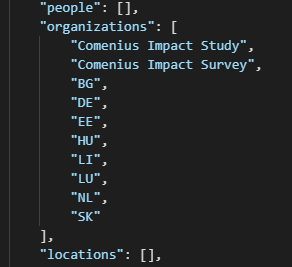

# Custom Skills Implementation

https://docs.microsoft.com/pl-pl/azure/developer/python/tutorial-vs-code-serverless-python-01 - Azure Functions Configuration

https://docs.microsoft.com/pl-pl/azure/search/search-what-is-an-index - Creating Search service and Storage service

 

Summary:

1. Create Azure Storage with Blob Storage - import all files into the storage
2. Create Azure Search service - inside define one index for files, and create indexer (to have full control, I did not set it for periodic use)
3. Azure SkillSets - default skills that can be applied like finding info about people, locations, numbers and adresses.

Up to this point the task was pretty straightforward and consisted mostly of following the path laid in the second attached link. Following steps are more complicated, the Custom Skills are created via the Azure Functions service.

1. Install the Azure Functions Core Tools 
2. Install VS Code
3. Install Extensions: Azure Functions, Azure Storage
4. Log into new project
5. Create Http triggered function
6. Deply the trigger as full Az. Function, and use it as endpoint for skillset

At this point the work with VS code has ended.

1. Add fiels inside indexes - best to keep the nameing scheme continous
2. Add field inside indexer 
3. Add a function into skillset, as new skill (best to use appropreate template)
4. Reset Indexer
5. Run Indexer to force it to create new features

## First skill

Very often the naming scheme and the extentions of the files are important for the search results - considering this, the custom skill was created, that allows for filtering of the files via the names parts - name_tags and file extentions.

If file contains:

- 'eu' - the tag with 'European Union' is assigned
- 'us' - tag 'USA' is asogned 
- tags database can be expanded - for now tags are hardcoded into function, but could be moved

If file extention is:

- '.jpeg', '.jpg', '.bmp', '.png' - the tag 'Image'  is assigned

- '.pdf' - the tag 'Complete Raport' is assigned

- '.xls', '.xlsx' - 'Calculations'

- '.doc', '.docx', '.odt' - 'Editable Raport'

- different extentions - 'Undefined'

## Second skill

Second custom skill will concentrate on the problem of not-compleate or misinterpreted data. The very often occuring problem in the dataset analysis was that the ISO-shortened country names were interpreted as companies/organizations names. 

So to resolve this issue it was decided to reach deep into the enrichement levels and pick the tables containing the mistakes. Next the shortened versions of the names were changed into the full names, and added into seperate column. Now even if only shortened name occures in the file, the relation can be found by serching for both, shortened and non-shortened version of name. 

## Important

- Add JSON into skill set
- Add field into index
- Add filed into indexer in JSON (remambair about correct context)
- Chech the position of argument in the JSON document structure - (eg. document/merged_content/...) always use full path to avoid problems